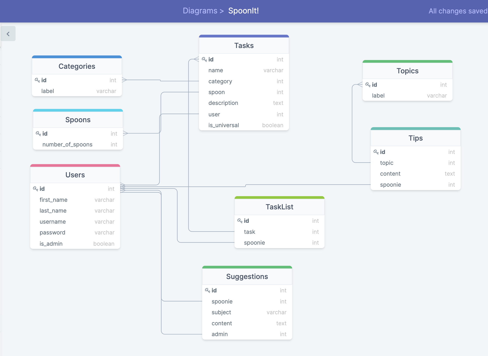

# View server-side code : [SpoonIt! Server](https://github.com/myriamchevalier/spoonit-server)

# SpoonIt! Client
This task randomizer application was inspired by the Spoon Theory, and people who use it help mange their day. 
It can be hard to know where to start when the backlog of to-do keeps growing, and the randomizer aims to take decision paralysis out of the equation.


## Motivation
As far as I can remember, housework has been a struggle for me, and no amount of to-do lists helped me. When I was younger, I found an app that randomized tasks based on how much time you wanted to spend on it. It helped, but there were days when tasks that were labeled `10 minutes` would take me much more time, because my energy levels were lower that day. 

Growing up, I learned about the Spoon Theory, and how it might help me manage my spoons (energy level) better. I started thinking about building a task randomizer app based on the Spoon Theory the very day I decided to go to Nashville Software School.

I also added a section for users to share tips, as dealing with chronic pain or conditions that make you a "spoonie" can be very isolating and discouraging, and I wanted to have a way for users to feel connected to a community.


## Setup

### Client

```
git clone git@github.com:myriamchevalier/spoonit-client.git
npm install
npm start
```
### Server

```
git clone git@github.com:myriamchevalier/spoonit-server.git
pipenv shell
pipenv install
python3 manage.py makemigrations
python3 manage.py migrate
python3 manage.py loaddata topics categories spoons tasks

python3 manage.py runserver
```

## How to use

Clone the client and server sides of the application and do the installations.
In the app, register as a new user.

The task randomizer is the user's homepage. From there, users can roll to get a random task, or select filters and apply them to their roll.

Users can navigate to **Manage task**, where they will see a list of tasks, have the option to create new ones, edit and delete tasks they have previously created.
They also have the option to filter by tasks they have created, by category, and by number of spoons.

Users can also navigate to **Manage tips**, where they can view all tips shared by other users and themselves. They can create, edit and delete tips.
They also have the option to filter the tips by topic.

## ERD
<p float="left">
    
</p>


